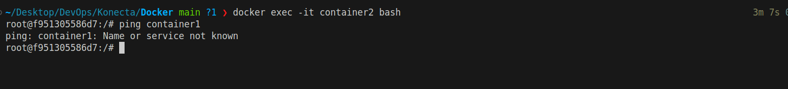
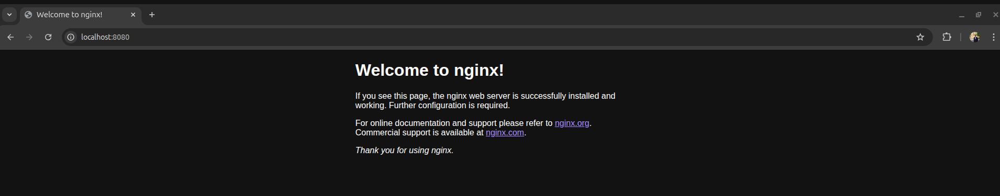

# Task: Docker Images & Networking

## Part 1: Working with Docker Images

### 1. Pull the Alpine and Nginx Images

**Commands:**
```bash
docker image pull nginx   # Pull images
docker image pull alpine
docker images             # List images
```

**Output:**  


---

## Additional Questions – Docker Images (No Dockerfile / Build)

### 1. What is the Difference Between an Image and a Container?

| Aspect      | Image (Immutable)                                   | Container (Mutable)                                   |
|-------------|-----------------------------------------------------|-------------------------------------------------------|
| Mutability  | Read-only, cannot be changed after creation         | Writable, can be modified during runtime              |
| State       | Stateless, just a template (layers + metadata)      | Stateful, has runtime state (processes, files, etc.)  |
| Lifecycle   | Build → Tag → Push/Pull → Delete                    | Create → Start → Run → Stop → Remove                  |

---

### 2. What Happens if You Run `docker run nginx` Twice Without Removing the First Container? Why?

- Two independent containers are created from the same image.
- Both containers bind to port 80 inside their own container.
- Host port binding must be unique; you cannot map the same host port to two containers.

---

### 3. Can Two Containers Be Created from the Same Image at the Same Time? What Happens to Their File Systems?

- Yes, multiple containers can be created from the same image simultaneously.
- Each container gets its own thin writable layer on top of shared read-only image layers.
- All containers share image layers, but their changes are isolated.

---

### 4. What’s the Difference Between `docker image ls` and `docker ps`? When Would You Use Each?

- **`docker image ls`:** Lists locally available images (repository, tag, ID, created date).
    - Use to check available images, start new containers, or clean up unused images.
- **`docker ps`:** Lists running containers (ID, image, command, status, ports, name).
    - Use to check running containers, troubleshoot, or manage workloads.

---

### 5. What’s the Purpose of Tagging an Image (e.g., `myapp:1.0`)? What Happens if You Don’t Specify a Tag?

- Tags identify specific versions of an image (semantic versioning, rollback, etc.).
- If no tag is specified, Docker uses `:latest` by default (not always the newest version).

---

### 6. How Does Docker Know Which Image to Use When You Run `docker run ubuntu`?

1. Assumes tag is `latest`.
2. Checks local cache for `ubuntu:latest`.
3. If not found, pulls from remote registry.

---

### 7. If You Delete a Container, Does It Delete the Image Too? Why or Why Not?

- No, deleting a container does not delete its image.
- Images are blueprints; containers are runtime instances.
- Images remain for future container creation.

---

### 8. What Does This Command Do?

```bash
docker pull ubuntu && docker run -it ubuntu
```
- Pulls the latest Ubuntu image.
- Runs a new container interactively with a terminal.

**Output:**  


---

### 9. You Have a Local Image `nginx:latest`. What Happens if You Run `docker pull nginx` Again?

- Docker checks the registry for updates.
- If the digest matches, no download occurs.
- If updated, only new/changed layers are downloaded.

---

### 10. What’s the Difference Between These Two Commands?

#### `docker rmi nginx`
```bash
docker rmi nginx
```
- Removes a specific image.
- Blocked if containers use the image (unless forced).

#### `docker image prune`
```bash
docker image prune
```
- Removes all unused (dangling) images.
- Does not remove tagged or used images.

---

### 11. True or False: Docker Images Can Be Shared Between Different Operating Systems

- **True:** Docker images are based on OS-level features, not hardware virtualization.
- Linux images run on any OS with a Linux kernel.

---

### 12. Can You Save a Docker Image as a File and Share It Without Pushing to Docker Hub? How?

- Yes, use `docker save`:
    ```bash
    docker save -o myimage.tar myapp:1.0
    ```
- Produces a `.tar` archive with all layers and metadata.

---

### 13. What is the Result of This Command? Why Might You Use It?

```bash
docker save -o backup.tar nginx
```
- Creates a portable tar archive of the nginx image.

**Use Cases:**
- Backup, offline sharing, disaster recovery, distribution.

---

### 14. How Can You Copy an Image from One Machine to Another Without Using Docker Hub or a Registry?

1. Save the image: `docker save -o myimage.tar myapp:1.0`
2. Transfer the file to the target machine.
3. Load the image: `docker load -i myimage.tar`
4. Run as usual: `docker run -d myapp:1.0`

---

### 15. How Do You Inspect the Internal Metadata of an Image? What Kind of Information Can You Find?

- Use: `docker inspect image_name_or_id`
- Information includes:
    - Image ID & Digests
    - Repo tags
    - Layers
    - History
    - Configuration
    - OS & Architecture
  
## Part 2: Networking and Bridge Mode


### 2.1. Run two containers without specifying a network:

`Command`
```bash
docker run -dit --name container1 ubuntu infinity
docker run -dit --name container2 ubuntu infinity
```
`Output`


### 2.2. Try to ping `container1` from `container2`:

- What happens? Why?

`Command`
```bash
docker exec -it container2 bash
ping container1
```
`Output`


`Result:` This will fail.

`Why:` Because the default bridge network does not have automatic DNS-base container name resolution.


### 2.3. Inspect the `docker0` bridge network and check container IPs

`Command`
```bash
docker network inspect bridge
```
`Output`


### 2.4. Now try pinging `container1` from `container2` using IP address.

`Command`
```bash
docker exec -it container2 bash
ping -c 4 172.17.0.2
```

`Result:` This works, because:


 - Both containers are on the same bridge network.

 - They can reach each other using IPs.


## Part 3: Port Forwarding

### 3.1. Run an Nginx container with port forwarding

`Command`
```bash
docker run -d --name nginx-container -p 8080:80 nginx 
```

`Output`


### 3.2. Access the container from the browser or using `curl`

`Command`
```bash
curl localhost:8080 
```
`Output`




### 3.3. Try running a second Nginx container with the same port mapping. What happens? Why?

`Result`: This will fail with an error like


`Why?`

 - Docker maps host port → container port.

 - Host port 8080 is already taken by nginx-container.

 - You can’t bind two containers to the same host port at the same time.


# Task: Docker Volums

## Part 1 – Basic Dockerfile

### 1.1. Create a directory named `docker_task`.
### 1.2. Inside it, create a file named `Dockerfile` that:
   - Uses **`alpine`** as the base image.
   - Installs `curl`
   - Runs `cat hello from container` when the container starts.

```Dockerfile
# Use alpine as the base image
FROM alpine

# Install curl
RUN apk add --no-cache curl

# Command to run when container starts
CMD [ "echo", "hello from container" ]
```

### 1.3. Build the image and tag it as `my-basic-image:v1`.

`Command`
```bash
docker build -t my-basic-image:v1
docker run --rm my-basic-image:v1
```
`Output`


## Part 2 – Volumes

### 2.1. Bind Mount

- Create a local directory `data_bind` and put a file `bind_note.txt` inside it.
- Run the container so that `/app/data` inside the container is linked to `data_bind` on your local machine.
- Verify that changes in the container are reflected locally.

`Result:`


### 2.2. Named Volume

#### Create a named volume called `my_named_volume`.

`Command`
```bash
docker volume create my_named_volume
docker volume ls
```

`Result:`


#### Run the container using this named volume mounted at `/app/named`.

`Command`
```bash
docker run -it --name named-test \
-v my_named_volume:/app/named \
alpine sh
```

#### Create a file inside `/app/named` from inside the container 


`Result:`


#### check it persists after container deletion

`Command`
```bash
docker run -it --name named-test2 \
-v my_named_volume:/app/named \
alpine sh
```

`Result:`


# Task: Dockerfile

## 1. Containerized the following App

### 1.1. Create Docker file for the app

```Dockerfile
## Use node:20 as the base image
FROM node:20

# Set working directory
WORKDIR /app

# Copy package files 
COPY package*.json ./

# Install aLL dependencies 
RUN npm install

# Copy the rest of the source
COPY . .

# Build the app
RUN npm run build

# Expose port 3000
EXPOSE 3000

# Start the app
CMD ["npm", "run", "start"]
```

### 1.2. Build Container from Dockerfile and run container 

`Command`
```bash
docker build -t ts-api-demo:v1 .
docker run -d --rm -p 3000:3000 ts-api-demo:v1
```
`Result`


### 1.3. Test it 

`Result`


Check out my repo here: [GitHub - Abdu-khaled/docker-practice](https://github.com/Abdu-khaled/docker-practice.git)